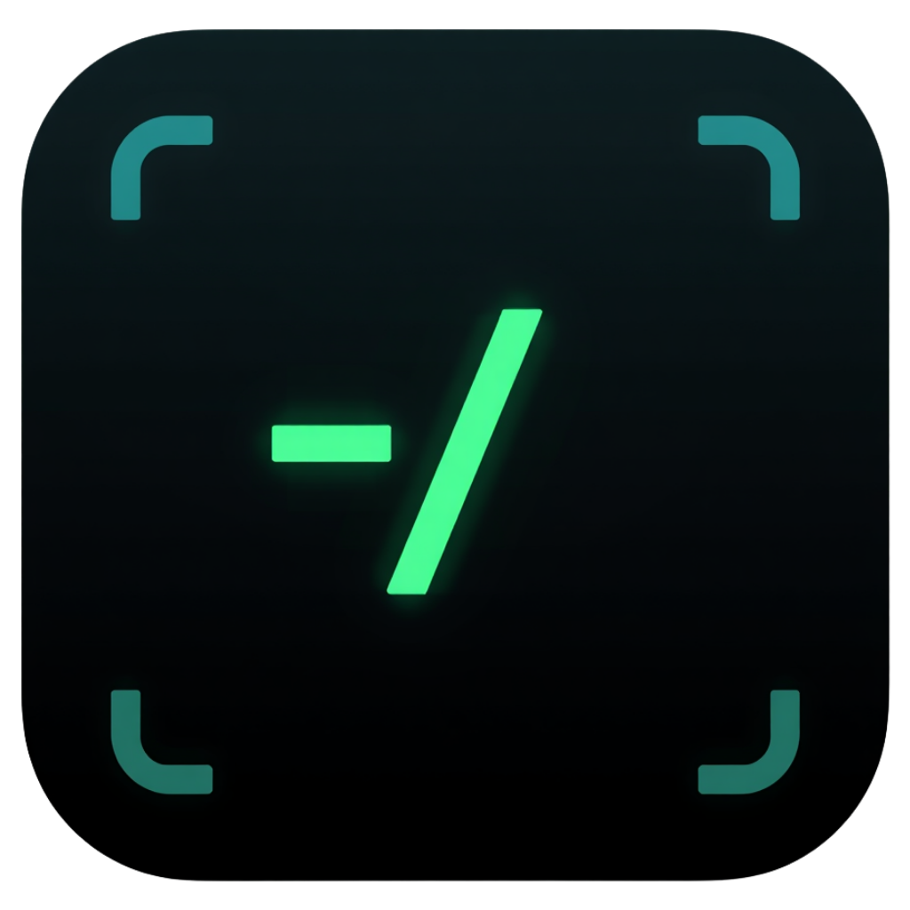

# DevHub

App macOS native pour développeurs qui en ont marre de jongler entre le terminal, le moniteur d'activité, et 15 onglets. Tout est regroupé dans une seule fenêtre avec une interface style terminal hacker.

Vous lancez DevHub, vous voyez vos projets, vos ports, vos process, l'état de votre machine — et vous agissez directement dessus.



## Ce que ça fait

**Gérer vos projets** — DevHub scanne vos dossiers (configurables), détecte automatiquement le type de projet (Node, Swift, Python, Rust, Go), affiche la branche git et le statut. Vous lancez vos commandes dev/staging/prod en un clic, directement dans des terminaux intégrés.

**Surveiller votre machine** — CPU, RAM, disque, batterie en temps réel. Ports TCP ouverts avec le process associé. Kill un port qui bloque en un clic.

**Nettoyer** — Xcode DerivedData, simulateurs obsolètes, caches Yarn/CocoaPods/Arc… DevHub calcule la taille de chaque cache et vous laisse nettoyer individuellement ou tout d'un coup.

**Actions rapides** — Flush DNS, purge RAM, kill Xcode, restart Dock, vider la corbeille… Les actions courantes sont prêtes, et vous pouvez ajouter les vôtres.

**Garder vos outils à jour** — Node, Python, Homebrew, Docker, Xcode, Rust… DevHub détecte les versions installées et propose les mises à jour disponibles.

## Prérequis

- macOS 14.0+
- Xcode 16.0+
- [XcodeGen](https://github.com/yonaskolb/XcodeGen) 2.40.0+

```bash
brew install xcodegen
```

## Installation

```bash
# Cloner le repo
git clone https://github.com/<ton-username>/DevHub.git
cd DevHub

# Générer le projet Xcode
xcodegen generate

# Ouvrir dans Xcode et lancer (Cmd+R)
open DevHub.xcodeproj
```

### Build Release + installation

```bash
xcodebuild -project DevHub.xcodeproj -scheme DevHub -configuration Release build

# Copier dans Applications
cp -R ~/Library/Developer/Xcode/DerivedData/DevHub-*/Build/Products/Release/DevHub.app /Applications/
```

## Architecture

```
DevHub/
├── project.yml                  # Config XcodeGen
└── DevHub/                      # Sources Swift
    ├── DevHubApp.swift          # Point d'entrée
    ├── Models/                  # Structures de données
    ├── Services/
    │   ├── ShellService.swift   # Actor async pour commandes shell
    │   └── ProcessManager.swift # Orchestrateur de terminaux SwiftTerm
    ├── ViewModels/              # Un ViewModel par module (MVVM)
    ├── Views/
    │   ├── Dashboard/           # Écran d'accueil avec stats temps réel
    │   ├── Cleaner/             # Module nettoyage
    │   ├── QuickActions/        # Actions rapides
    │   ├── Projects/            # Gestion de projets
    │   ├── Processes/           # Terminaux intégrés
    │   ├── Ports/               # Scan ports réseau
    │   ├── DevEnv/              # Environnement dev
    │   ├── System/              # Moniteur système
    │   ├── Settings/            # Configuration (scan paths, etc.)
    │   └── Theme/HackerTheme.swift  # Design system (couleurs, composants)
    └── Utilities/               # Helpers (calcul taille disque)
```

### Principes

- **MVVM** — Chaque module a son ViewModel (`@MainActor ObservableObject`)
- **ShellService** — Actor Swift unique pour toutes les commandes shell (thread-safe, gestion timeout)
- **ProcessManager** — Gère les terminaux SwiftTerm, wrapping des commandes avec `nvm use` + `cd`
- **PersistenceManager** — Sauvegarde JSON dans `~/.devhub/devhub.json` (launch commands, actions custom, scan paths)
- **HackerTheme** — Design system centralisé : palette, modifiers, composants réutilisables

## Dépendances

| Package | Version | Usage |
|---------|---------|-------|
| [SwiftTerm](https://github.com/migueldeicaza/SwiftTerm) | 1.13.0 | Terminal VT100/VT220 natif pour les process |

Installé automatiquement via Swift Package Manager à l'ouverture du projet.

## Chemins scannés

Par défaut, DevHub scanne tous les sous-dossiers directs de `~/Documents/` pour détecter vos projets.

Vous pouvez configurer vos propres dossiers de scan via le bouton ⚙ dans la barre de navigation (Settings → ajouter/supprimer des dossiers, reset aux défauts). La configuration est sauvegardée dans `~/.devhub/devhub.json`.

Les projets sont détectés par la présence de `package.json`, `.xcodeproj`, `Cargo.toml`, `go.mod`, `requirements.txt`, etc.
